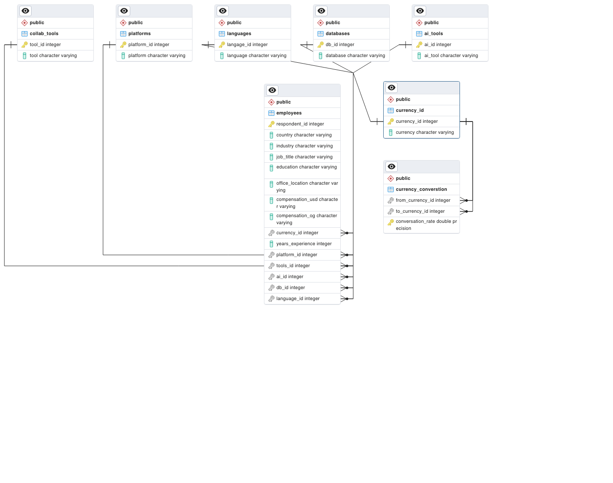

```{r setup, include=FALSE}
knitr::opts_chunk$set(echo = TRUE)

# Load environment variables
if (!require(dotenv)) print("dotenv package not installed")
library(dotenv)
dotenv::load_dot_env()

# Load database interface package
if (!require(RPostgres)) print("RPostgres package not installed")
library(RPostgres)

# Establish database connection
sql_db <- dbConnect(
  RPostgres::Postgres(),
  dbname = Sys.getenv("DB_NAME"),
  host = Sys.getenv("DB_HOST"),
  port = as.integer(Sys.getenv("DB_PORT")),
  user = Sys.getenv("DB_USER"),
  password = Sys.getenv("DB_PASSWORD")
)
```

## Introduction

```{r load-libraries, warning=FALSE, message=FALSE}
library(tidyverse)
```

## Data overview:

This report is based on a survey of 89,184 software developers from 185 countries around the world. This is the number of responses we consider “qualified” for analytical purposes based on consenting to share their information in this survey and finishing all the required questions; approximately 2,000 responses were not included in this analysis. The survey was fielded from May 8, 2023 to May 19, 2023.

```{r load-data}
#Load the original .csv file from Stack Overflow
survey_2023 <- read.csv("https://media.githubusercontent.com/media/alexandersimon1/Data607/main/Project3/survey_results_public.csv", header = TRUE)
```

We filter the survey for only the observations of interest - those who identified as "Data scientists or Machine-Learning Specialist" and "a developer by profession", so that all survey results reflect our population of interest - professional, working data scientists.

```{r filter-data}
# Filter for the observations of interest
datascientists_2023 <- survey_2023 %>% 
  filter(DevType == "Data scientist or machine learning specialist",
         MainBranch == "I am a developer by profession")
```

### Database Design

This is the ER Diagram of our SQL database:

{width="913"}

Generated ID tables in PostgreSQL for all the possible answers from the survey for each topic we want to examine.

## Data Tidying

The survey data will be tidied in R, pushed to pre-made relational tables in PostgreSQL, and then analyzed through R.

### Tidy the Data

**NOTE to authors** - because there is already a table with the USD value of an observation's compensation already converted, I'm using that column for our 'compensation_usd' column

```{r tidy-ds_2023, warning=FALSE}
# Match df to 'employee' table format
employees_df <- datascientists_2023 %>% 
  mutate(response_id = ResponseId,
         country = as.factor(Country),
         job_title = as.factor(DevType),
         industry = as.factor(Industry), 
         education = as.factor(EdLevel),
         office_location = as.factor(RemoteWork),
         compensation_usd = as.numeric(ConvertedCompYearly),
         years = as.numeric(YearsCodePro),
        language = LanguageHaveWorkedWith,
        platform = PlatformHaveWorkedWith,
        database = DatabaseHaveWorkedWith,
        collab_tools = NEWCollabToolsHaveWorkedWith,
        ai_tools = AIDevHaveWorkedWith
  ) %>% 
  select(response_id, 
         country,
         job_title,
         industry,
         education,
         office_location,
         compensation_usd,
         years,
         language,
         platform,
         database,
         collab_tools,
         ai_tools)
```

### Normalize the Multiple Answers

Our variables of interest were all in response to select-all-that-apply survey questions. In order to record each of the answers, each of the 5 multi-choice answer columns must be split so that there is one answer per column in a relational table in the database.

We pivot our survey results longer so that every checkbox has an observation. But if we keep them in the same table, we'll double our data.

We convert multiple choice questions to factors for ease-of-use later.

```{r create-factors}
# Columns of interest to factors
employees_df <- employees_df %>% 
  mutate(language_id = as.factor(language),
         platform_id = as.factor(platform),
         db_id = as.factor(database),
         tool_id = as.factor(ifelse(collab_tools == "Unknown", NA, collab_tools)),
         ai_id = as.factor(ifelse(ai_tools == "Unknown", NA, ai_tools))
  )
```

We define functions for algorithms we will run repeatedly. I tried to write a function that did all the steps to normalize each survey question, but it was too nuanced.

```{r define-functions}
# Define split-and-unnest function
split_and_unnest <- function(data, columns, na_replace = "") {
  split_data <- lapply(columns, function(col) str_split(data[[col]], ";"))
  names(split_data) <- columns
  
  split_data <- lapply(split_data, function(x) replace(x, is.na(x), na_replace))
  
  data <- data %>%
    mutate(across(all_of(columns), ~split_data[[cur_column()]])) %>%
    unnest(cols = all_of(columns))
  
  return(data)
}

#convert
convert_to_factors <- function(data, columns) {
  data <- data %>%
    mutate(
      across(all_of(columns), as.factor)
    )
  return(data)
}
```

Normalize each survey question we are interested in to its own table.

```{r languages-pivot}
languages_df <- employees_df %>%
  select(response_id, language_id) %>% 
  split_and_unnest('language_id', na_replace = "Unknown") 
  
language_id <- dbGetQuery(sql_db, "SELECT * FROM id_languages") %>%
  convert_to_factors(c("language_id", "language"))

languages_df$language_id <- language_id$language_id[match(languages_df$language_id, language_id$language)]  %>% as.numeric()
```

```{r platforms-pivot}
platforms_df <- employees_df %>%
  select(response_id, platform_id) %>% 
  split_and_unnest('platform_id', na_replace = "Unknown") 
  
platform_id <- dbGetQuery(sql_db, "SELECT * FROM id_platforms") %>%
  convert_to_factors(c("platform_id", "platform"))

platforms_df$platform_id <- platform_id$platform_id[match(platforms_df$platform_id, platform_id$platform)]  %>% as.numeric()
```

```{r db-pivot}
db_df <- employees_df %>%
  select(response_id, db_id) %>% 
  split_and_unnest('db_id', na_replace = "Unknown") 
  
db_id <- dbGetQuery(sql_db, "SELECT * FROM id_databases") %>%
  convert_to_factors(c("db_id", "database"))

db_df$db_id <- db_id$db_id[match(db_df$db_id, db_id$database)]  %>% as.numeric()
```

```{r tools-pivot}
tools_df <- employees_df %>%
  select(response_id, tool_id) %>% 
  split_and_unnest('tool_id', na_replace = "Unknown") 
  
tool_id <- dbGetQuery(sql_db, "SELECT * FROM id_collab_tools") %>%
  convert_to_factors(c("tool_id", "tool"))

tools_df$tool_id <- tool_id$tool_id[match(tools_df$tool_id, tool_id$tool)] %>% as.numeric()
```

```{r ai-pivot}
ai_df <- employees_df %>%
  select(response_id, ai_id) %>% 
  split_and_unnest('ai_id', na_replace = "Unknown") 
  
ai_id <- dbGetQuery(sql_db, "SELECT * FROM id_ai_tools") %>%
  convert_to_factors(c("ai_id", "ai_tool"))

ai_df$ai_id <- ai_id$ai_id[match(ai_df$ai_id, ai_id$ai_id)] %>% as.numeric()
```

All our relational tables are created and have their data.

```{r clean-employees_df}
employees_sql <- employees_df %>% 
  select(response_id, country, industry, education, office_location, compensation_usd, years)


```

Our SQL relational database is now clean and tidy! I have removed the functions that write to the SQL database so our tables don't get overwritten. They were all variations of `dbWriteTable(sql_db, "employees_language", languages_df, append = TRUE)`

## Analysis

Let's do some analysis!
```{r list-tables}
dbListTables(sql_db)
```

## Conclusion

### Bibliography
