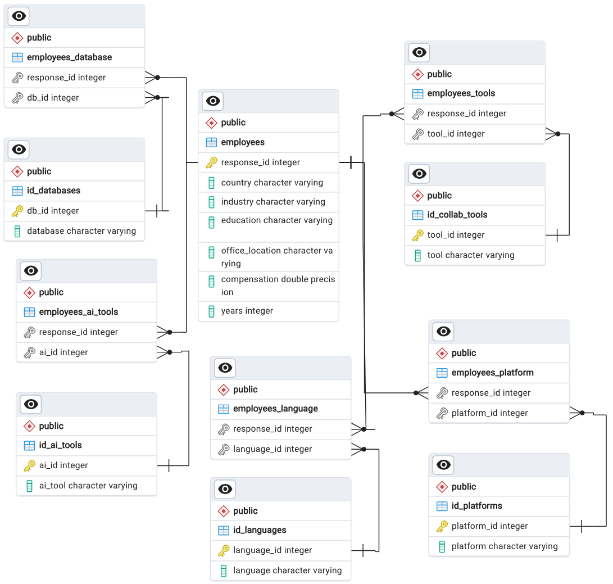

```{r setup, include=FALSE}
knitr::opts_chunk$set(echo = TRUE)

# Load environment variables
if (!require(dotenv)) print("dotenv package not installed")
library(dotenv)
dotenv::load_dot_env()

# Load database interface package
if (!require(RPostgres)) print("RPostgres package not installed")
library(RPostgres)

# Establish database connection
sql_db <- dbConnect(
  RPostgres::Postgres(),
  dbname = Sys.getenv("DB_NAME"),
  host = Sys.getenv("DB_HOST"),
  port = as.integer(Sys.getenv("DB_PORT")),
  user = Sys.getenv("DB_USER"),
  password = Sys.getenv("DB_PASSWORD")
)
```

## Introduction

```{r load-libraries, warning=FALSE, message=FALSE}
library(tidyverse)
```

## Data overview:

This report is based on a survey of 89,184 software developers from 185 countries around the world. This is the number of responses we consider “qualified” for analytical purposes based on consenting to share their information in this survey and finishing all the required questions; approximately 2,000 responses were not included in this analysis. The survey was fielded from May 8, 2023 to May 19, 2023.

```{r load-data}
#Load the original .csv file from Stack Overflow
survey_2023 <- read.csv("https://media.githubusercontent.com/media/alexandersimon1/Data607/main/Project3/survey_results_public.csv", header = TRUE)
```

We filter the survey for only the observations of interest - those who identified as "Data scientists or Machine-Learning Specialist" and "a developer by profession", so that all survey results reflect our population of interest - professional, working data scientists.

```{r filter-data}
# Filter for the observations of interest
datascientists_2023 <- survey_2023 %>% 
  filter(DevType == "Data scientist or machine learning specialist",
         MainBranch == "I am a developer by profession")
```

### Database Design

This is the ER Diagram of our SQL database:

{width="985"}

Generated ID tables in PostgreSQL for all the possible answers from the survey for each topic we want to examine.

## Data Tidying

The survey data will be tidied in R, pushed to pre-made relational tables in PostgreSQL, and then analyzed through R.

### Tidy the Data

\*\*NOTE to authors - because there is already a table with the USD value of an observation's compensation already converted, I'm using that column for our 'compensation_usd' column

```{r tidy-ds_2023, warning=FALSE}
# Match df to 'employee' table format
employees_df <- datascientists_2023 %>% 
  mutate(response_id = ResponseId,
         country = as.factor(Country),
         job_title = as.factor(DevType),
         industry = as.factor(Industry), 
         education = as.factor(EdLevel),
         office_location = as.factor(RemoteWork),
         compensation_usd = as.numeric(ConvertedCompYearly),
         years = as.numeric(YearsCodePro),
        language = LanguageHaveWorkedWith,
        platform = PlatformHaveWorkedWith,
        database = DatabaseHaveWorkedWith,
        collab_tools = NEWCollabToolsHaveWorkedWith,
        ai_tools = AIDevHaveWorkedWith
  ) %>% 
  select(response_id, 
         country,
         job_title,
         industry,
         education,
         office_location,
         compensation_usd,
         years,
         language,
         platform,
         database,
         collab_tools,
         ai_tools)
```

### Split the Columns

Our variables of interest were all in response to select-all-that-apply survey questions. In order to record each of the answers, each of the 5 multi-choice answer columns must be split so that there is one answer per column, and then pivoted back together for a long, tidy, easily queried database.

We pivot our survey results longer so that every checkbox has an observation

```{r call-split_and_unest}

# Define split-and-unnest function
split_and_unnest <- function(data, columns, na_replace = "") {
  split_data <- lapply(columns, function(col) str_split(data[[col]], ";"))
  names(split_data) <- columns
  
  split_data <- lapply(split_data, function(x) replace(x, is.na(x), na_replace))
  
  data <- data %>%
    mutate(across(all_of(columns), ~split_data[[cur_column()]])) %>%
    unnest(cols = all_of(columns))
  
  return(data)
}

employees_df <- employees_df %>%
  split_and_unnest('language', na_replace = "Unknown") %>% 
  split_and_unnest('platform', na_replace = "Unknown") %>% 
  split_and_unnest('database', na_replace = "Unknown") %>%
  split_and_unnest('collab_tools', na_replace = "Unknown") %>% 
  split_and_unnest('ai_tools', na_replace = "Unknown")

```

We convert multiple choice questions to factors for ease-of-use later.

```{r create-factors}
# Columns of interest to factors
employees_df <- employees_df %>% 
  mutate(language = as.factor(language),
         platform = as.factor(platform),
         database = as.factor(database),
         collab_tools = as.factor(ifelse(collab_tools == "Unknown", NA, collab_tools)),
         ai_tools = as.factor(ifelse(ai_tools == "Unknown", NA, ai_tools))
  )
```

Dataframe `employee_df` is now clean and tidy.

### Cross-reference ID numbers

Now we cross-reference the string in each cell with its corresponding ID number using the ID tables. We create a new dataframe to do this, so that we always have a dataframe with the actual answers, and other that references ID tables on the server.

First load the ID number tables from the server.

```{r load-id-tables}
# Define convert_to_factors function
convert_to_factors <- function(data, columns) {
  data <- data %>%
    mutate(
      across(all_of(columns), as.factor)
    )
  return(data)
}

# Apply the function to each database table
language_id <- dbGetQuery(sql_db, "SELECT * FROM languages") %>%
  convert_to_factors(c("language_id", "language"))

db_id <- dbGetQuery(sql_db, "SELECT * FROM databases") %>%
  convert_to_factors(c("db_id", "database"))

ai_id <- dbGetQuery(sql_db, "SELECT * FROM ai_tools") %>%
  convert_to_factors(c("ai_id", "ai_tool"))

platform_id <- dbGetQuery(sql_db, "SELECT * FROM platforms") %>%
  convert_to_factors(c("platform_id", "platform"))

tools_id <- dbGetQuery(sql_db, "SELECT * FROM collab_tools") %>%
  convert_to_factors(c("tool_id", "tool"))
```

If all our columns are factors, we can easily use the `match()` function to replace our column values with their corresponding ID numbers from the ID tables.

```{r map-ids}
# Replace factor values with integer IDs
employees_sql <- employees_df

employees_sql$language <- language_id$language_id[match(employees_sql$language, language_id$language)] 

employees_sql$platform <- platform_id$platform_id[match(employees_sql$platform, platform_id$platform)] 

employees_sql$database <- db_id$db_id[match(employees_sql$database, db_id$database)]

employees_sql$collab_tools <- tools_id$tool_id[match(employees_sql$collab_tools, tools_id$tool)]

employees_sql$ai_tools <- ai_id$ai_id[match(employees_sql$ai_tools, ai_id$ai_tool)]

# Reclassify factor columns
employees_sql <- employees_sql %>% 
  mutate(language_id = as.numeric(language),
         platform_id = as.numeric(platform),
         db_id = as.numeric(database),
         tool_id = as.numeric(collab_tools),
         ai_id = as.numeric(ai_tools)) %>% 
  select(response_id, 
         country,
         job_title,
         industry,
         education,
         office_location,
         compensation_usd,
         years,
         language_id,
         platform_id,
         db_id,
         tool_id,
         ai_id)
```

Our 'employees_sql' dataframe is clean, tidy and in the format we need for SQL. Time to write the table to the server.

```{r write-employee-table}
dbWriteTable(sql_db, "employees", employees_sql, append = TRUE)
```

## Analysis

At this point, `employees_df` is ready for analysis, and has all the names of the skills as factors.

`employees_sql` has the answers replaced with their ID numbers, in reference to their related database tables.

Both formats (or calls to the server!) are ready for analysis.

```{r list-tables}
dbListTables(sql_db)
```

## Conclusion

### Bibliography
